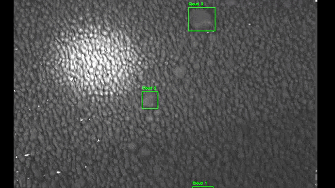

    
# Object Detection and Segmentation
### Task
It is a real-life industry task. [This video](https://homeassistant.kotah.ru/local/clodding_train.avi) contains the footage of the outcome of a clodding machine. It grinds the soil or rocks and turns them into equally-sized clods, which are passed to the next step in the production chain. When the clodding machine malfunctions, it produces abnormally big clods which may damage the next machine and disable the entire chain.  
Your task is to implement an online diagnostic system based on Computer Vision.  The customer wants the system to 
1) Detect abnormal clods 
2) Estimate the number of them in each frame
3) Estimate the size of the biggest one in the frame. 

Here you can see a fragment of the video with tracking processed by the system:


## Models

The project uses two types of models: [Ultralytics YOLOv8](https://ultralytics.com/yolov8 ) (fully operational with tracking) and U-Net(the model was implemented from scratch)

##  Installation
 Run following command in shell:\
``` 
$ pip install -r requirements.txt
```

## User Gide
### CLI

The system works through the following CLI commands:
1. train:
```$ python path/to/model.py train --parameter=value```

2. evaluate: ```$ python path/to/model.py evaluate --parameter=value```


4. demo: ```$ python path/to/model.py demo --parameter=value```

``` 
Parameters:
    tracking: bool; by default: False. If true, the function includes object tracking in the real-time detection.
Output: return frames in live
```
